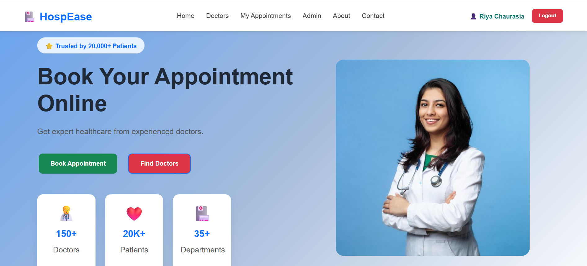
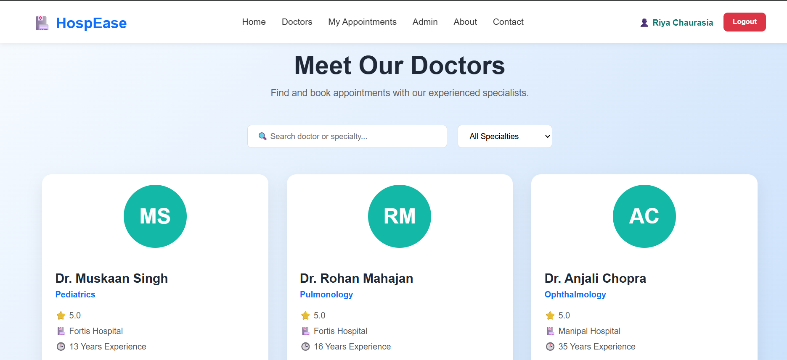
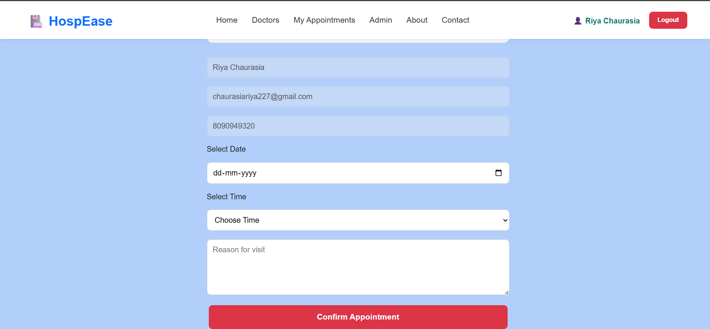
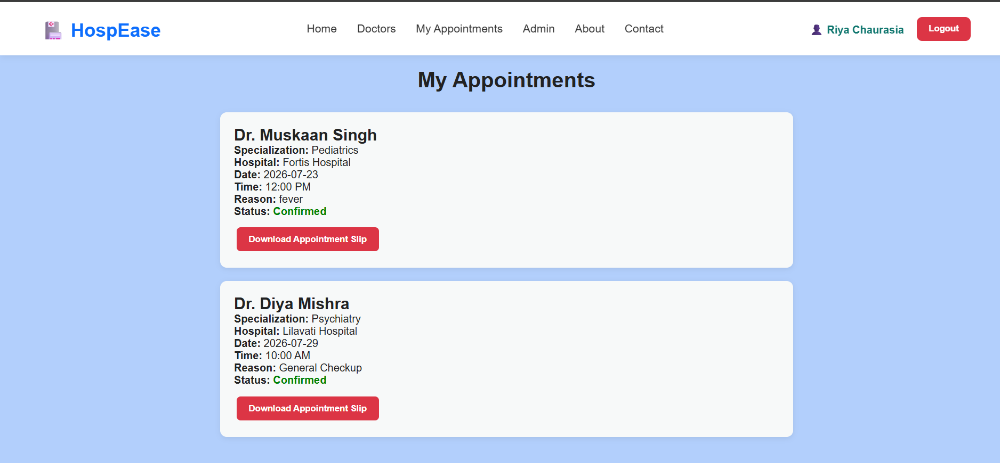
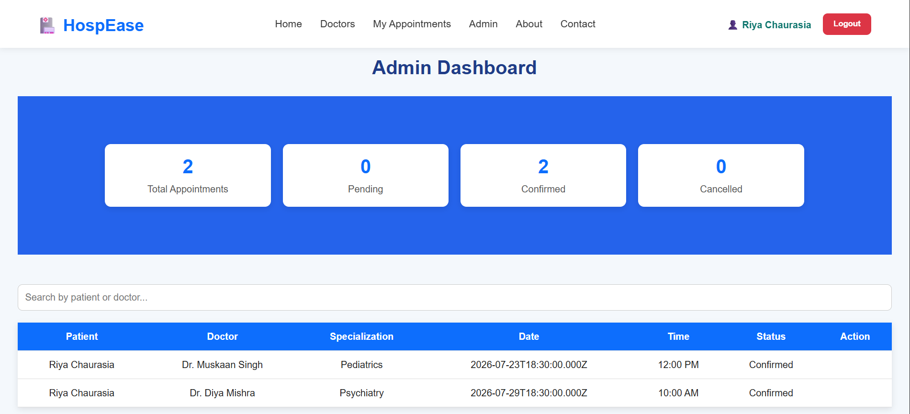

# A Full-Stack Hospital Appointment Management System built with React, Node.js, Express, MySQL, and JWT Authentication.

HospEase is a full-stack Hospital Appointment Management System that streamlines the process of booking and managing doctor appointments. It provides separate functionalities for patients and administrators with secure JWT-based authentication and role-based access control.

---

## ✨ Features

### 👤 Patient Module
- User Registration & Login
- JWT Authentication
- Browse Doctors
- Search Doctors
- View Doctor Details
- Book Appointments
- View Appointment History
- Download Appointment Slip (PDF)
- Track Appointment Status (Pending, Confirmed, Cancelled)

### 👨‍💼 Admin Module
- Secure Admin Login
- View All Appointments
- Search by Patient or Doctor
- Confirm Appointments
- Cancel Appointments
- Dashboard Statistics
  - Total Appointments
  - Pending Appointments
  - Confirmed Appointments
  - Cancelled Appointments

---

# 🛠 Tech Stack

## Frontend
- React.js
- React Router DOM
- Axios
- CSS3
- jsPDF

## Backend
- Node.js
- Express.js
- JWT Authentication

## Database
- MySQL

---

# 📁 Folder Structure

```
E-Hospital
│
├── client
│   ├── src
│   ├── public
│   ├── package.json
│
├── server
│   ├── config
│   ├── middleware
│   ├── routes
│   ├── package.json
│
├── screenshots
│
└── README.md
```

---

# 🚀 Installation

## Clone Repository

```bash
git clone https://github.com/Chaurasiariya227/E-Hospital.git
```

---

## Backend Setup

```bash
cd server
npm install
npm run dev
```

---

## Frontend Setup

```bash
cd client
npm install
npm run dev
```

---

# Database

Create a MySQL database named:

```
hospease
```

Import the SQL file and update the database configuration in:

```
server/config/db.js
```

---

# 🔐 Authentication

- JWT Authentication
- Protected Routes
- Role-Based Authorization
- Admin & Patient Access Control

---

# 📸 Screenshots

## Home Page



---

## Doctors Page



---

## Book Appointment



---

## My Appointments



---

## Admin Dashboard



---

# Future Enhancements

- Online Payment Gateway
- Email Notifications
- Appointment Reminder System
- Doctor Availability Calendar
- Medical Reports Upload
- Online Video Consultation

---

# 👩‍💻 Author

**Riya Chaurasia**

GitHub: https://github.com/Chaurasiariya227

---

⭐ If you found this project useful, consider giving it a star!
